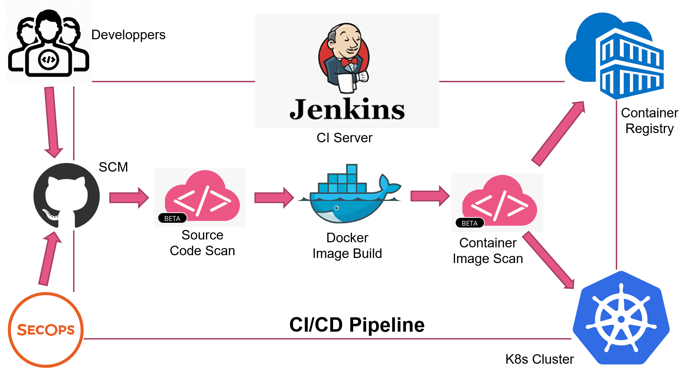
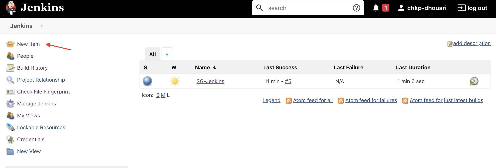
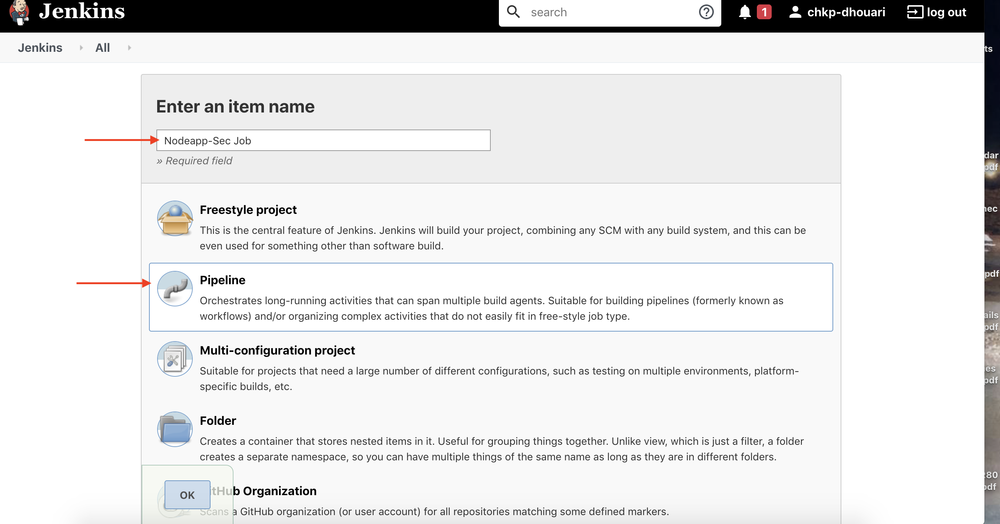
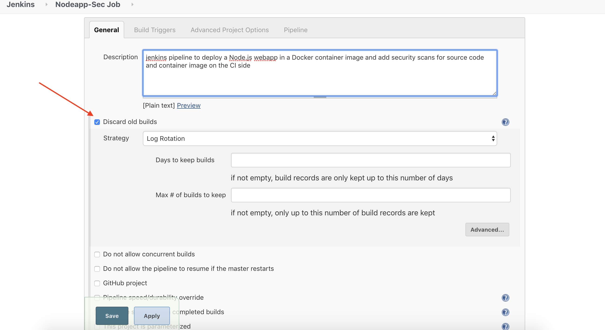
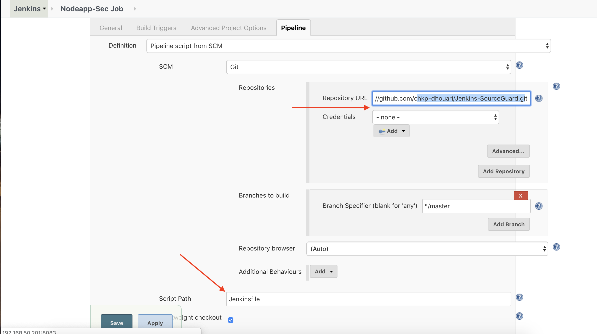
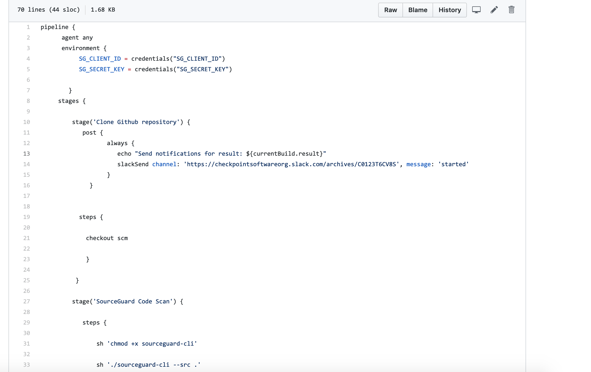
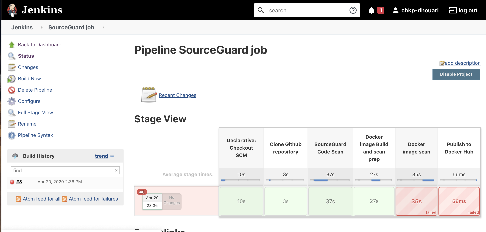
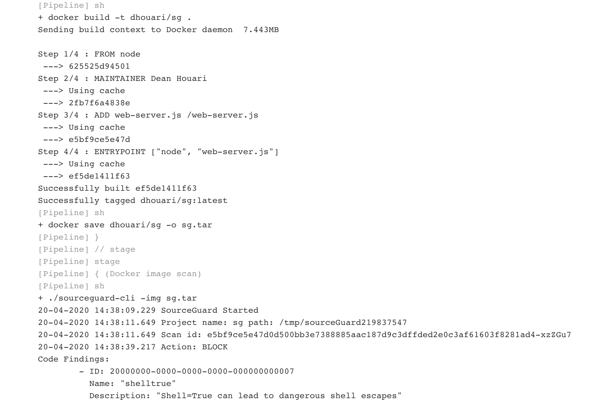
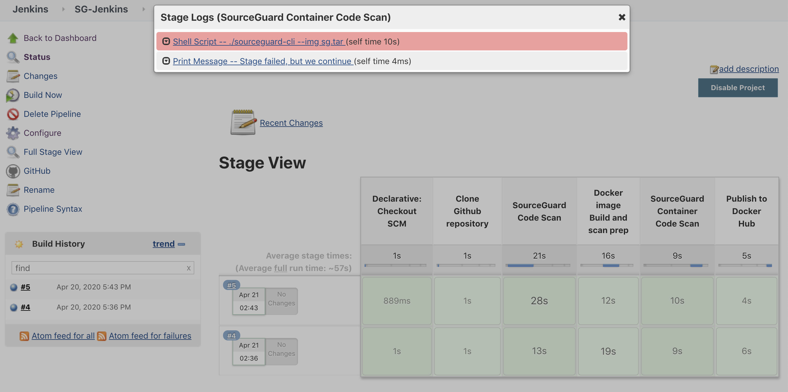

# Using the Check Point SourceGuard SAST Scanner in a Jenkins CICD Pipeline 

## DevSecOps Tutorial to integrate in a Jenkins pipeline used to build a node.js app and deployed in a docker container, uploaded to a registry and in K8s cluster.

Developpers are embracing devops as it is enabling the automate their application development and deployment at large scale.
They using the CICD methodolgy to build their app s using the code checked in a SCM(source code manager) in order to build and package into a container image to be stored in a container registry or/and deployed in a Kubernetes cluster for runtime.
We will be using Github and Git as SCM and Docker for container runtime. SecOps team are adopting DevSecOps to natively integrate security tools in the CI/CD toolchain in order to ensure the security of the build and runtime of their application prior to its deployment to production. This page will cover how the Check Point SourceGuard SAST scanner can be integrated in a Jenkins CICD pipeline to address the source code and container image scan and analysis against CVEs, vulnerabilities and know/unknown malware.

#### For more info about SourceGuard,
> https://github.com/chkp-dhouari/SourceGuard

The app will be a simple node.js app in a docker container.
lets first provision the Jenkins server and I will be using jenkins on a ubuntu VM using Virtualbox. I recommend allocating a minimumof 512MB of memory and a few Gigs of HDD space for tolerable Jenkins build performance. The same applies if you are running Jenkins in a container. 

 
        
 
 The first step is to install Jenkins on Ubuntu
 
 > https://wiki.jenkins.io/display/JENKINS/Installing+Jenkins+on+Ubuntu
 
 By default Jenkins listens to port 8080 and I would recommend changing that. In this lab, I am using port 8282

 > You can change the default by changing the value of HTTP_PORT=  on /etc/default/jenkins
 
 The First step is to create a new pipeline on Jenkin 
 
  
  
 Assign a name for the pipeline and chose the pipeline option as I will be using a Jenkins declarative pipeline script then press on OK
 
  
  
 This will take you to the pipeline configuration step. The first step is the General section where I suggest chosing to discard old build to save disk space which can fillup quickly and the GitHub project by pasting the GitHUb project URL.
 
 
 
 
 You can schedule the time where the Builds are trigerred and the final step is to configure the Pipeline section that define your SCM and Jenkinsfile which the Jenkins pipeline script. 
 
 
 
 
 I am using the Jenkins 2.x declarative pipeline which needs to be saved as jenkinsfile in your SCM for the build 
 https://jenkins.io/doc/book/pipeline/syntax/#declarative-pipeline
 

 
 
 SourceGuard can be added to a Jenkins pipeline using the SourceGuard cli or SourceGuard container. 
 
```
 
  stage('SourceGuard Code Scan') {
            agent {

              docker { image 'sourceguard/sourceguard-cli' }

              }
            steps {

                sh "/sourceguard-cli --src ./"

                   }
              }
 
  or
  
  stage('SourceGuard Code Scan') {
  
            steps {
              
                sh "chmod +x sourceguard-cli"
                sh "sourceguard-cli --src ."

                   }
              }
              
 ```
 
 The build workflow step would show as follow:
 
 
 
 The Jenkins build failed as SourceGuard container image analysis reported it as BLOCK. 
 
  
  
  
###  It is possible to run the Jenkins pipeline job as Alert only and not failing a stage though the SourceGuard analysis is BLOCK by changing the scan stage as follow:
 
  ```
  
  stage('SourceGuard Container Image Scan') {   
          steps {   
                   
             script {      
                 try {
         
                    sh './sourceguard-cli --img sg.tar'
           
                } catch (Exception e) {
    
                    echo "Stage failed, but we continue"  
                     }
                }
            }
         }
   
   ```
  


   
        
        
